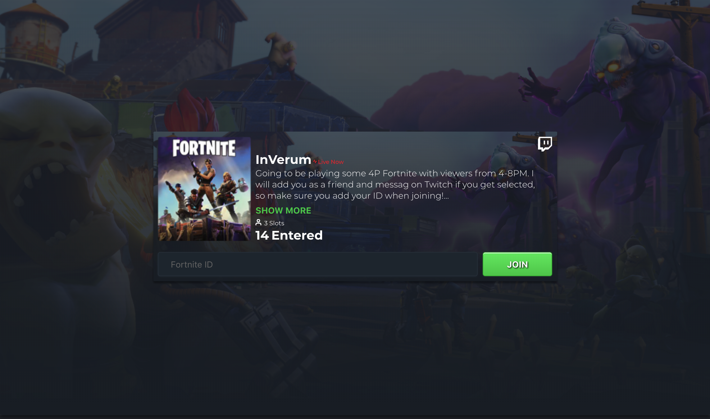
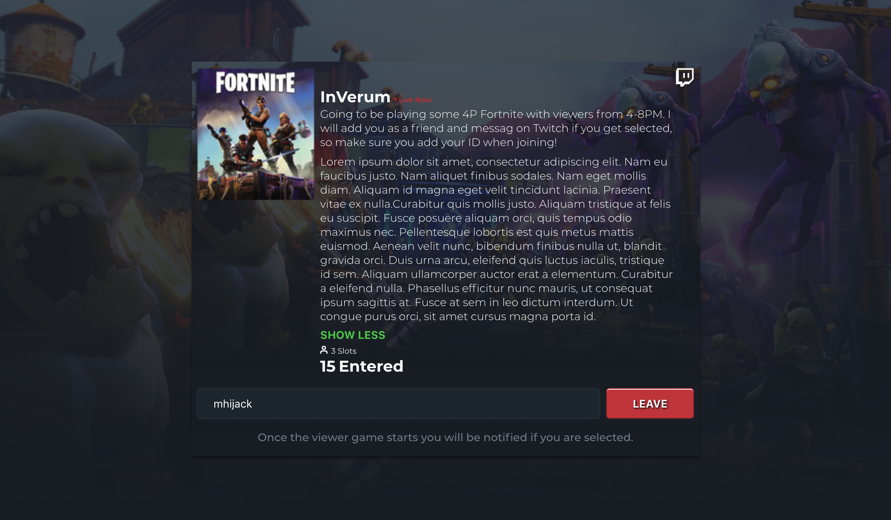

# GamerLink Viewer Games Widget

**A demo widget built for GamerLink App's viewer games feature.** (resize your browser window to see responsiveness!)

There are 3 states the user can toggle:
1. Extra description expanded / hidden
2. Joined / unjoined the queue
3. Intermediate state: button will be disabled while waiting for joining / unjoining to complete. (setTimeout is used to simulate communication with server)




****
### Usage:

You must have npm installed on your local machine.

Create an empty directory and cd into it. Then execute the following commands in terminal:

```
git clone https://github.com/mhijack/gamerlink-viewer-games.git

cd gamerlink-viewer-games

npm install

npm start
```
****

### TODO
* all clear!